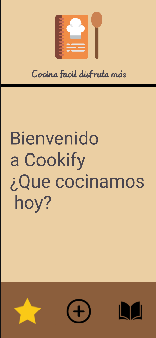

# Cookify - Gestor de Recetas.

  
  

* La aplicación desarrollada consiste en un gestor de recetas
personalizado que permite al usuario guardar y organizar todos sus platos y recetas de manera
eficiente.

# Características principales:
	
	* Gestión de recetas mediante operaciones (CRUD): crear recetas, buscar tus recetas, eliminar recetas.
	* Base de datos local: Implementación de SQL para el almacenamiento y persistencia de datos.
	* Optimización de memoria: Gestión de las imágenes subidas por el usuario en la base de datos.
	* Diseño optimizado: Aplicación diseñada y orientada a la facilidad y comodidad de uso del usuario.

# Instalación y Documentación
* **📦 APK:** [Descargar ejecutable (.apk)](ejecutables/cookify.apk)
* **📄 Manual de uso:** [Ver Manual de Usuario (PDF)](documentacion/manualDeUso_Cookify.pdf)
